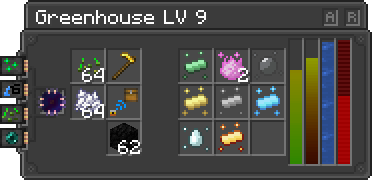

---
navigation:
  title: Greenhouse
  icon: infinity_nexus_greenhouse:greenhouse
  position: 300
categories:
  - machines
item_ids:
  - infinity_nexus_greenhouse:greenhouse
  - infinity_nexus_greenhouse:fertilizer_upgrade
  - infinity_nexus_greenhouse:planter_upgrade
  - infinity_nexus_greenhouse:irrigate_upgrade
  - infinity_nexus_greenhouse:collector_upgrade
---

# Greenhouse

Welcome to the **Infinity Nexus Greenhouse** guide! The greenhouse is a powerful tool for harvesting all your crops.
The greenhouse requires an enclosed room, with a maximum internal area depending on the component's tier.

## Requirements to Work
- Redstone OFF
- Component
- Energy
- Plants [Minimum 1]
- Size less than or equal to the component (see list below)
- Light level of 4 or higher
- 1 Farm Villager
- Link [Optional]

## Interface
- **[A]**: This button sinaliza os blocos no interior da estrutura bem como mostra quais e a quentidade de cada planta na area, necessary components installed.
- **[R]**: This button reveals all available greenhouse recipes corresponding to the tier components. It serves as a comprehensive guide to the greenhouse's capabilities.

## Tier Blocks Inside Structure
- **Tier 1**: 50 Blocks
- **Tier 2**: 100 Blocks
- **Tier 3**: 200 Blocks
- **Tier 4**: 300 Blocks
- **Tier 5**: 400 Blocks
- **Tier 6**: 600 Blocks
- **Tier 7**: 800 Blocks
- **Tier 8**: 1000 Blocks
- **Tier 9**: 1200 Blocks

## Upgrades

The greenhouse can be enhanced with the following upgrades:

- **<ItemImage id="infinity_nexus_core:speed_upgrade" /> Speed Upgrade:** Increases harvesting speed.
- **<ItemImage id="infinity_nexus_core:strength_upgrade" /> Strength Upgrade:** Improves energy efficiency.
- **<ItemImage id="infinity_nexus_core:muffler_upgrade" /> Muffler Upgrade:** Disables greenhouse sounds.
- **<ItemImage id="infinity_nexus_core:pusher_upgrade" /> Pusher Upgrade:** Ejects items to the greenhouse's upper inventories or any configured direction on the upgrade.
- **<ItemImage id="infinity_nexus_greenhouse:fertilizer_upgrade" /> Fertilizer Upgrade:** Fertilizes all crops inside the greenhouse area if possible.
- **<ItemImage id="infinity_nexus_greenhouse:planter_upgrade" /> Planter Upgrade:** Places seeds and crops in farmlands inside the greenhouse when seeds are in the greenhouse's seed slots.
- **<ItemImage id="infinity_nexus_greenhouse:irrigate_upgrade" /> Irrigate Upgrade:** Irrigates all farmlands inside the greenhouse area.
- **<ItemImage id="infinity_nexus_greenhouse:collector_upgrade" /> Collector Upgrade:** Collects all dropped items inside the greenhouse area and sends them to the greenhouse inventories.
- **<ItemImage id="infinity_nexus_core:linking_tool" /> Linking Tool:** Sends items to linked inventories.

## Greenhouse Recipe

To craft the greenhouse, use the following recipe:

<RecipeFor id="infinity_nexus_greenhouse:greenhouse" />

## Structure Example
The structure can be built in any shape, as long as the interior space meets the component's size requirements.

<GameScene zoom="2" interactive={true}>
  <ImportStructure src="structures/greenhouse.nbt" />
  <IsometricCamera  yaw="30" pitch="30" />
</GameScene>